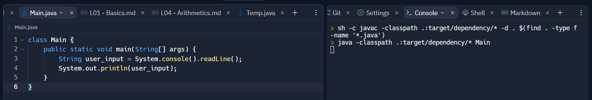
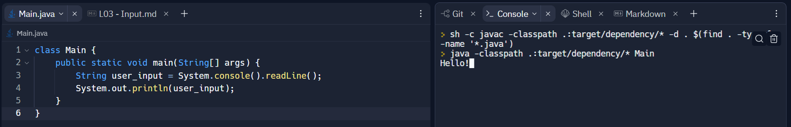
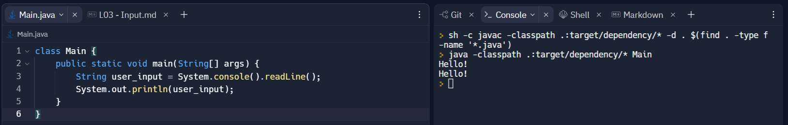
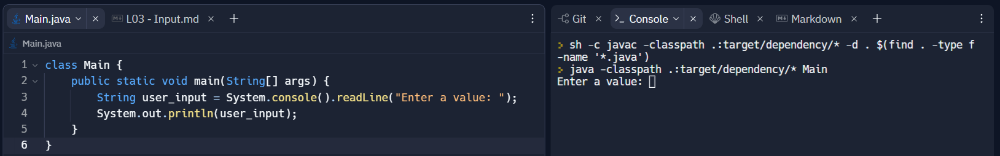

# How to get user inputted values in Java
```java
class Main {
    public static void main(String[] args) {
        String user_input = System.console().readLine();
        System.out.println(user_input);
    }
}
```

## Using the ```.console().readLine()``` command

We can consider ```System``` to be a toolbox that contains special tools for our Java program.

Example: ```System.out.println()``` allows us to access a way to output to the console.

For us to get an input from the user via the console, we would need to _read the data_.

From ```System```, we are accessing a tool called: ```.console().readLine()``` to allow us to do so.

__NOTE:__ ```.console().readLine()``` will read the data as a String data.

## Example Usage
(Sample 1)

> Currently our code is executing ```System.console().readLine();``` which is waiting for the user to input a value in the console. We can write a message in the console and press ```enter``` to input.

(Sample 2)

> Notice that in the console, we wrote: ```Hello!``` let's see what happens if we press enter

(Sample 3)

> Notice that in the console, we have two ```Hello!```. The first ```Hello!``` is the one that we inputted. Since our program is designed to output the data, we get ```Hello!``` outputted.

## Adding a Prompt to Your Input

```java
String user_input = System.console().readLine("Enter a value: ");
```

Inside our ```.console().readLine()``` we can put a String data to output a special message for the person using our program.

## SOURCE
- geeksforgeeks -- [https://www.geeksforgeeks.org/ways-to-read-input-from-console-in-java/](https://www.geeksforgeeks.org/ways-to-read-input-from-console-in-java/)
- ORACLE -- [https://docs.oracle.com/javase/7/docs/api/java/io/Console.html](https://docs.oracle.com/javase/7/docs/api/java/io/Console.html)